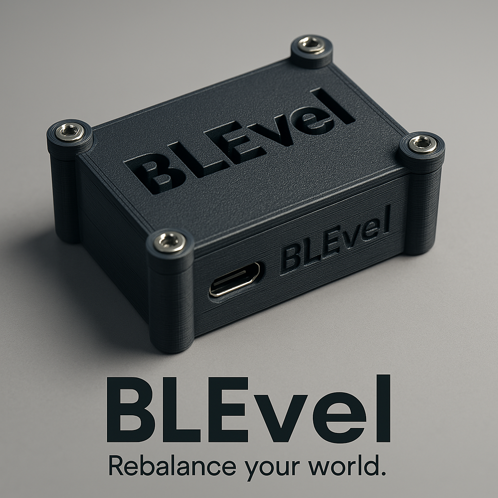

# BLEvel – Das digitale Nivelliersystem für Camper

**BLEvel** ist ein präzises, digitales Neigungsmesssystem (Pitch & Roll) für Wohnmobile, Campervans und DIY-Projekte.  
Es misst kontinuierlich die Fahrzeuglage und überträgt die gefilterten Werte per **Bluetooth Low Energy (BLE)** an ein Smartphone oder Tablet – in Echtzeit.

---

## Features

- **Pitch & Roll Messung** über einen LSM6DS3-Sensor
- **ESP32-C3** als energieeffizienter BLE-fähiger Mikrocontroller
- **300 Hz Sensor-Abtastrate**
- **Gleitender Mittelwertfilter** zur Vibrationsunterdrückung
- **30 Hz BLE-Übertragung** der gefilterten Werte
- **Kalibrierbar per App oder BLE-Client**
- **Einstellungen dauerhaft speicherbar (EEPROM)**
- Kompaktes Design für festen Einbau im Camper
- Open-Source – einfach anpassbar für eigene Projekte

---

## Aufbau

**Hardware-Komponenten:**

- ESP32-C3 Devboard (z. B. NodeMCU ESP32-C3)
- LSM6DS3 IMU (I²C, z. B. SparkFun Breakout)
- Optional: 3D-gedrucktes Gehäuse (STL-Datei enthalten)

**Software:**

- MicroPython Firmware
- Custom Script mit BLE-GATT-Server
- Bibliothek für LSM6DS3
- Konfigurierbare Einstellungen über BLE

---

## Anwendung

BLEvel wurde für den **festeinbau im Camper** entwickelt – unter Betten, Schränken oder am Boden.  
Die Kalibrierung erfolgt einmalig auf ebener Fläche. Danach zeigt das System in Echtzeit die relative Neigung an – perfekt für das schnelle Ausrichten mit Keilen oder Luftfederung.

Code und nähere Informationen folgen...
